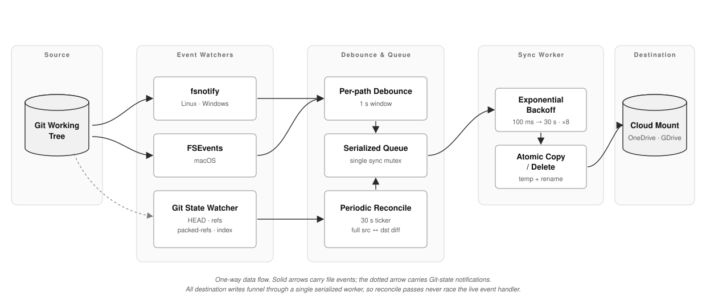

# gdsync — `git-drive-sync`

> One-way sync from a Git working tree to a cloud-mounted folder.
> Built for AI agents that rewind often.

[](https://go.dev) []() []()

🌐 **English** ・ [日本語](README.ja.md)

`gdsync` mirrors a Git working tree to a destination folder — typically a OneDrive, Google Drive, Dropbox, or iCloud Drive mount. Real-time watcher, `.gitignore`-aware, retries through cloud file locks. The point: when `git reset --hard` shrinks your tree, the cloud folder shrinks with it.

---

## The problem

AI coding agents (Claude Code, Cursor, Aider) edit fast and undo often. When the project lives in a cloud-synced folder, two things break:

1. **Cloud clients sync against their own snapshot, not against Git.** When an agent deletes a file and a rewind partially restores it, the cloud's "deleted" state goes out of sync. Files reappear, copies multiply, conflicts surface.
2. **They can't tell intent from movement.** A `git reset --hard HEAD~5` that removes 40 files looks identical to a user deleting 40 files. Sometimes OneDrive propagates the delete, sometimes it "rescues" the files back.

The fix is to stop using the cloud folder as a workspace. Use it as a mirror and refresh it from Git. That's all `gdsync` does.

---

## What it does

- Watches the working tree with FSEvents (macOS) or fsnotify (Linux, Windows).
- Honors `.gitignore`, including nested ones, plus a built-in skip list: `.git/`, `.claude_code/`, `.cursor/`, `.DS_Store`, `*.tmp`, `node_modules/`.
- Copies via `temp + rename`. Cloud clients never see a partially written file.
- Deletes from `--dest` the moment files disappear from the source.
- Reconciles `src` and `dst` every 30 s and on every Git state change (`HEAD`, refs, packed-refs, index). This is the rewind detector.
- Retries with exponential backoff on cloud-side file locks.
- Skips symlinks entirely (see below).

---

## Architecture

<p align="center">
  
</p>

### Git is the source of truth

`gdsync` only goes one way. Two-way sync needs conflict resolution, and conflict resolution needs an authoritative version — which is just Git, reinvented.

- `src` (Git tree) → `dst` (cloud mount). No exceptions.
- Anything in `dst` that isn't in `src` is removed on the next reconcile.
- You edit in `src`. You read or share via `dst`. Only one side is ever canonical.

Trade-off: changes made directly in `dst` are lost. For this use case, that's the right call.

### Retry on cloud-induced locks

Cloud clients open, hash, and re-upload files in the background. While they hold a file, `open()` and `rename()` against the destination can fail with:

- POSIX: `EAGAIN`, `EBUSY`, `ETXTBSY`, `EACCES`
- Windows: `ERROR_SHARING_VIOLATION`, `ERROR_LOCK_VIOLATION`, `ERROR_ACCESS_DENIED`, `ERROR_CLOUD_FILE_IN_USE`

`gdsync` retries with exponential backoff: 100 ms → 30 s, up to 8 attempts, jittered. Non-retryable errors (`ENOENT`, `ENOSPC`) fail fast.

Writes are atomic. A temp file is created in the destination directory (not `os.TempDir()` — that crosses volumes), `fsync`'d, then renamed. On Windows the rename goes through `MoveFileEx` with `MOVEFILE_WRITE_THROUGH`, so it's committed to disk before the call returns.

### Symlinks: skipped

Creating symlinks on Windows requires `SeCreateSymbolicLinkPrivilege`, which most user processes don't have. Rather than ship a feature that silently fails on Windows, `gdsync` skips symlinks on every platform. Source symlinks are ignored at walk time. Any symlink that ends up in `dst` is treated as an orphan and removed at the next reconcile.

### Size + mtime, not content hashing

The reconciler compares files by `(size, mtime)`. After every copy, `Chtimes` sets `dst.mtime = src.mtime`, so the steady state is exact equality within a 100 ms tolerance. OneDrive sometimes pushes `dst.mtime` forward after upload — the comparison only triggers when `src.mtime > dst.mtime + skew`, so that case is absorbed. Content hashing would scan every byte on every pass; rewind detection doesn't need it.

### Per-platform watching

- **macOS** uses `github.com/fsnotify/fsevents`. Recursive natively, easy on file descriptors.
- **Linux / Windows** use `github.com/fsnotify/fsnotify`. Recursive descent is done at startup. On new-directory events the subtree is walked, a watcher is added, and synthetic Create events are emitted for any children that landed before the watcher attached (the standard fsnotify race).

A 1 s per-path debounce collapses editor save sequences (write-temp + rename + fsync) into a single sync action.

### Git-state surveillance

A second watcher tracks `.git/HEAD`, `refs/heads/`, `packed-refs`, and `index`. Any change triggers an immediate reconcile. This catches:

- branch switches (`git checkout`)
- hard resets on the current branch (`git reset --hard`, where HEAD doesn't move but a ref does)
- index-only operations (`git checkout -- file`)
- garbage-collected refs (now in `packed-refs`)

Without this, you'd wait up to `--interval` seconds. With it, the cloud catches up in milliseconds.

---

## Install

### Go install

```sh
go install git-drive-sync/cmd/gdsync@latest
```

### From source

```sh
git clone <this repo> && cd git-drive-sync
make build           # → ./gdsync
make install         # → $GOBIN/gdsync
make dist            # → bin/gdsync-{darwin-arm64,darwin-amd64,windows-amd64.exe}
```

### Pre-built binaries

`make dist` produces macOS (arm64 + amd64) and Windows (amd64) binaries. Drop one on `PATH`.

Source builds need Go 1.22+. Pre-built binaries have no runtime dependency.

---

## Usage

```sh
cd ~/Code/my-project
gdsync --dest ~/OneDrive/my-project
```

That's it. `gdsync` reads `.gitignore`, copies the rest, and watches. `Ctrl-C` flushes a final reconcile before exit.

### Flags

| Flag | Default | Effect |
|---|---|---|
| `--dest` | required | Destination directory. Created if missing. |
| `--interval` | `30s` | Full reconcile interval. |
| `--debounce` | `1s` | Event debounce window per path. |
| `--dry-run` | `false` | Log actions; write nothing. |
| `-v`, `--verbose` | `false` | DEBUG-level logging. |
| `--once` | `false` | One reconcile pass, then exit. |
| `--max-retries` | `8` | Retries on cloud-side file locks. |

### Recipes

One-shot, no watcher (good for `cron`):

```sh
gdsync --dest ~/OneDrive/my-project --once
```

Tune `.gitignore` in dry-run:

```sh
gdsync --dest /tmp/inspect --dry-run -v
```

Background on macOS:

```sh
nohup gdsync --dest ~/OneDrive/my-project > ~/Library/Logs/gdsync.log 2>&1 &
```

---

## Out of scope

- **Two-way sync.** See "Git is the source of truth." Never coming.
- **Multiple destinations per process.** Run one `gdsync` per `--dest`.
- **Service installer (`launchd` / `systemd`).** Use your OS's service manager.
- **Config files.** Flags only, for now.
- **Conflict resolution.** There are no conflicts.

---

## Layout

```
gdsync/
├── cmd/gdsync/main.go          # cobra entry, event/dispatch loop
└── internal/
    ├── config/                 # flag parsing, path canonicalization
    ├── gitignore/              # matcher (go-git's parser)
    ├── watcher/                # FSEvents + fsnotify
    ├── sync/                   # backoff, retry, atomic copy, reconcile
    ├── gitstate/               # HEAD / refs / index watcher
    └── log/                    # slog wrapper
```

A single mutex serializes all destination writes. The reconciler and the event handler can't race.

---

## Testing

```sh
go test ./...
make vet
```

End-to-end smoke test:

```sh
SRC=$(mktemp -d) && DST=$(mktemp -d) && cd $SRC && git init -q
echo "*.log" > .gitignore
echo hello > a.txt && echo ignored > debug.log
gdsync --dest $DST --once -v
ls $DST                          # → a.txt, .gitignore
rm a.txt
gdsync --dest $DST --once -v
ls $DST                          # → .gitignore only (rewind propagated)
```

---

## License

[MIT](LICENSE) © 2026 Luca Minagawa

---

## Built on

- [`spf13/cobra`](https://github.com/spf13/cobra) — CLI framework
- [`fsnotify/fsnotify`](https://github.com/fsnotify/fsnotify) + [`fsnotify/fsevents`](https://github.com/fsnotify/fsevents) — filesystem events
- [`go-git/go-git`](https://github.com/go-git/go-git) — gitignore parser with correct nested semantics
- [`golang.org/x/sys/windows`](https://pkg.go.dev/golang.org/x/sys/windows) — `MoveFileEx`
